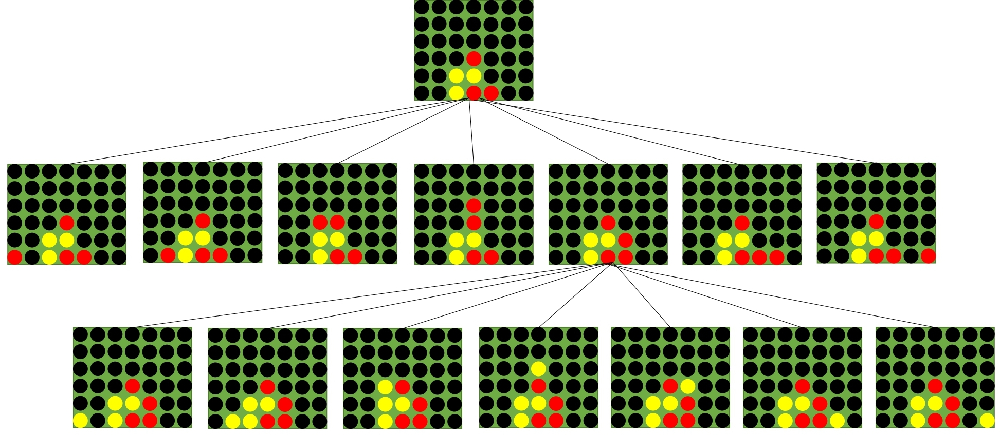

# Spielalgorithmus

## Module
```
pip install requests
pip install fastapi
pip install uvicorn[standard]
```
Ggf. muss uvicorn zu %PATH% hinzugefügt werden.

## Datenstruktur
### Spielfeld 7x6
```
6 0  0  0  0  0  0  0
5 0  0  0  0  0  0  0
4 0  0  0  0  0  0  0
3 h  0  0  r  0  0  0
2 h  r  r  h  r  0  r
1 h  h  h  r  h  r  r
--1--2--3--4--5--6--7

// h = Human Player | r = Robot Player | 0 = empty space
```

## Schnittstellen / Kommunikation
###  Bildverarbeitung -> Spielalgorithmus
```json
{ "Column1": {"Row1":"h", "Row2":"0", "Row3":"0", "Row4":"0", "Row5":"0", "Row6":"0"},
"Column2": {"Row1":"0", "Row2":"0", "Row3":"0", "Row4":"0", "Row5":"0", "Row6":"0"},
"Column3": {"Row1":"0", "Row2":"0", "Row3":"0", "Row4":"0", "Row5":"0", "Row6":"0"},
"Column4": {"Row1":"0", "Row2":"0", "Row3":"0", "Row4":"0", "Row5":"0", "Row6":"0"},
"Column5": {"Row1":"0", "Row2":"0", "Row3":"0", "Row4":"0", "Row5":"0", "Row6":"0"},
"Column6": {"Row1":"h", "Row2":"h", "Row3":"h", "Row4":"0", "Row5":"0", "Row6":"0"},
"Column7": {"Row1":"r", "Row2":"r", "Row3":"0", "Row4":"0", "Row5":"0", "Row6":"0"}
}
```

### Übertragung Spielalgorithmus -> Hardwaresteuerung
```json
{
 "col": 7,
 "row": 1
}
```

## Algorithmen
### Minimax
#### Allgemein
Der Minimax-Algorithmus ist eine Spielstrategie für sogennante Nullsummenspiele wie Vier gewinnt oder Tic Tac Toe.
Das Ziel ist es den optimalen nächsten Spielzug zu finden.
Beim Minimax gibt es zwei Spieler, die Max und Min genannt werden, wobei Max in unserem Fall den Roboter repräsentiert.
In abwechselnder Reihenfolge betrachtet der Algorithmus alle möglichen Kombination von Zügen für Max und Min.
Anhand dieser Möglichkeiten wird ein Entscheidungsbaum aufgespannt.
Jeder Möglichkeit wird anhand des Zustandes auf dem Spielbrett ein Wert (Score) zugewiesen.
Die Möglichkeit, die in den höchsten Score bringt wird letztendlich vom Algorithmus gewählt.

Der Algorithmus arbeitet rekursiv und wechselt jeden Zug zwischen dem "minimizing" und "maximizing" Spieler (siehe Abbildung).
Dabei wird die Suchtiefe für den Entscheidungsbaum pro Zug um eins verringert.
Um den perfekten Zug zu finden wird für jedem möglichen Spielzug ein Score für das Spielfeld berechnet.
Dazu wird das Spielfeld in Teilbereiche von vier Kästchen eingeteilt.
Dafür werden sowohl horizontale, vertikale, diagonal aufsteigende und diagonal absteigende Optionen berücksichtigt.
Teil des Spielfelds wird übergeben und anhand einer Heuristik ein Score berechnet.



#### Heuristik
Ein heuristischer Score wird für ein Segment von vier Kästchen berechnet.
Ein Kästchen kann dabei einen Spielstein des Roboters, des Menschens oder gar keinen Spielstein enthalten.

| Situation        | Score      |
| ------------- |:-------------:|
| Vier Spielsteine einer Farbe  | 15 |
| Drei Spielsteine einer Farbe und ein leeres Kästchen | 3 |
| Zwei Spielsteine einer Farbe und zwei leere Kästchen | 1 |
| Drei gegnerische Spielsteine und zwei leere Kästchen | -2 |
| Spielsteine einer Farbe (x) in der mittleren Spalte (4) | x * 3.5 |


#### Endbedingungen für den Algorithmus
Der Minimax berechnet so lange neue Möglichkeiten bis eines der folgenden Ereignisse eintritt. 
Zum Abschluss gibt der Algorithmus die Spalte für den nächsten Zug und den Score für diesen Zug zurück.

- Suchtiefe erreicht den Wert 0
- Volles Spielfeld (Unentschieden)
- Sieg für den Roboter
- Sieg für den Menschen

#### Pseudocode Minimax-Algorithmus

```python
def mini_max(board, depth, maximizing_player):

    if depth == 0 or is_terminal:
        return col, heuristic value

    if maximizing_player:
        value = -1000
        for col in possible_cols:
            new_score = self.mini_max(board_copy, depth - 1, False)[1]

            if new_score > value:
                value = new_score
                column = col
        return column, value

    else:
        value = 1000
        for col in possible_cols:
            new_score = self.mini_max(board_copy, depth-1, True)[1]

            if new_score < value:
                value = new_score
                column = col
        return column, value
```

Die rekursive Funktion erhält das aktuelle Spielfeld, die aktuelle Tiefe sowie den aktuellen Spieler (min oder max).
Zu Beginn wird überprüft, ob eine Endbedingung für die Funktion erreicht wurde.
Sollte dies der Fall sein wird mithilfe der zuvor definierten Heuristik der Score für das Spielfeld und
die Spalte für den nächsten Zug zurückgegeben.
In dem Fall, dass das Spiel noch nicht beendet ist wird mit einer if-Bedingung entweder Max oder Min ausgewählt.
Max versucht den Score durch testen der möglichen Spielzüge zu erhöhen.
Min hingegen versucht den Score zu verkleinern.

#### Programmiersprache / Tools
Der Algorithmus wurde in Python implementiert.
Zur Implementierung wurden keine externen Bibliotheken eingesetzt.

### Alpha-Beta-Optimierung
Der oben gezeigte Minimax-Algorithmus kann durch Alpha-Beta-Optimierung beschleunigt werden, indem man zusätzliche
Argumente für die aktuelle untere und obere Schranke (Alpha und Beta) hinzufügt. Alpha und Beta dienen dazu, den
Suchbereich des Algorithmus zu beschränken, indem bereits frühzeitig bestimmte Zweige des Suchbaums abgeschnitten werden,
sobald keine besseren Ergebnisse mehr erwartet werden. 

Während der Ausführung des Algorithmus werden die untere Schranke Alpha und die obere Schranke Beta für jeden Knoten
aktualisiert. Wenn "Alpha >= Beta" dann wird das aktuelle Unterknoten frühzeitig beendet, da es keine Auswirkung mehr auf
das Endresultat hat, egal ob es weiter ausgeführt wird oder nicht.

#### Pseudocode Alpha-Beta-Optimierung
```python
def mini_max(board, depth, maximizing_player, alpha, beta):
    if depth == 0 or is_terminal:
        return col, heuristic value

    if maximizing_player:
        value = -1000
        for col in possible_cols:
            new_score = self.mini_max(board_copy, depth - 1, False, alpha, beta)[1]
            if new_score > value:
                value = new_score
                column = col
            alpha = max(alpha, value)
            if alpha >= beta:
                break
        return column, value

    else:
        value = 1000
        for col in possible_cols:
            new_score = self.mini_max(board_copy, depth - 1, True, alpha, beta)[1]
            if new_score < value:
                value = new_score
                column = col
            beta = min(beta, value)
            if alpha >= beta:
                break
        return column, value
```

Sobald Alpha >= Beta ist, dann bedeutet das, dass der aktuell minimierende Spieler einen besseren Zug machen kann, als der
maximierende Spieler jemals erreichen wird. In diesem Fall kann die Suche beendet werden, da es keinen Sinn macht, weitere
Züge zu untersuchen, da dies nicht mehr zu einer Verbesserung führen würde. Der Zug des aktuellen Spielers ist quasi für
den gegnerischen Spieler ungünstiger, als dessen optimales Ergebnis. 

### Neuronales Netz als Bewertungsfunktion
...
